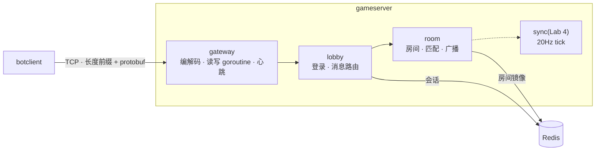

# game-server

一个 2–8 人实时同步小游戏的服务端,用 Go 写。TCP 长连接 + Protobuf,登录与会话落 Redis,房间、快速匹配和房间内广播;接下来是服务端 20Hz 状态同步和 500 并发压测。

## 进度

| | 内容 | 状态 |
|---|---|---|
| Lab 1 | 网关:长度前缀帧、每连接读写 goroutine、心跳、idle 踢人 | ✅ |
| Lab 2 | 登录:HMAC token 校验,会话落 Redis,顶号 | ✅(MySQL 账号表未做) |
| Lab 3 | 房间:创建 / 加入 / 快速匹配 / 离开,事件广播,Redis 镜像 | ✅ |
| Lab 4 | 服务端 20Hz tick,状态同步 | 进行中 |
| Lab 5 | 500 bot 压测 + Prometheus 指标,产出 P99 | 计划中 |
| Lab 6 | Docker Compose 一键起 | 计划中 |

## 架构



分层、协议、连接生命周期和并发模型见 [docs/ARCHITECTURE.md](docs/ARCHITECTURE.md)。每个设计决定「为什么是这个 / 为什么不是别的 / 什么时候会换」见 [docs/DECISIONS.md](docs/DECISIONS.md)。

## 怎么跑

需要 Go 1.27+。跑服务端还需要一个 Redis,用 Docker 起最省事。

```bash
git clone https://github.com/Anthonyz5527083/game-server.git
cd game-server

make test     # 全部测试(带 -race)。Redis 用进程内的 miniredis,不需要 Docker
make redis    # docker compose 起一个只绑 127.0.0.1 的 Redis
make run      # 服务端,监听 :7777
make bot      # 另开一个终端:玩家 1 登录,发 20 个 Ping
```

看房间广播:开两个终端,两个 bot 快速匹配进同一个房间。

```bash
./bin/botclient -player 1 -match -n 100 -q
./bin/botclient -player 2 -match -n 5 -q
```

第一个终端会看到第二个人进来、离开:

```
logged in as player 1
in room 1, members [1]
push: room_event:{kind:JOINED player_id:2 room:{room_id:1 capacity:8 members:1 members:2}}
push: room_event:{kind:LEFT player_id:2 room:{room_id:1 capacity:8 members:1}}
```

`make run` / `make bot` 用的 token 密钥是 Makefile 里写死的开发用值,不是秘密。部署时用环境变量 `GS_TOKEN_SECRET` 传一个至少 16 字节的随机串;`./bin/tokengen -player 42` 用同一个密钥签发 token。

## 协议速览

```
+----------------------+-----------------------------------+
| length: uint32 大端  | body: Envelope 的 protobuf 编码    |
+----------------------+-----------------------------------+
Envelope { seq, oneof payload }   字段号:10–19 网关 · 20–29 登录 · 30–39 房间 · 40–49 同步
```

单帧上限 64 KiB。完整定义见 [proto/game.proto](proto/game.proto)。

## 压测

尚未测量,Lab 5 产出。测量方法和目前的微基准见 [docs/BENCHMARK.md](docs/BENCHMARK.md)。

## 目录

```
proto/              协议定义(生成的 Go 代码入库,在 internal/pb)
cmd/gameserver/     服务端入口
cmd/botclient/      冒烟 / 压测客户端
cmd/tokengen/       开发用的 token 签发工具
internal/gateway/   TCP 连接、帧编解码、心跳、发送队列
internal/auth/      HMAC token
internal/lobby/     登录状态机、消息路由
internal/room/      房间、快速匹配、广播、Redis 镜像同步
internal/storage/   Redis:会话、房间镜像
deploy/             docker compose(目前只有 Redis)
docs/               ARCHITECTURE · DECISIONS · BENCHMARK
```
