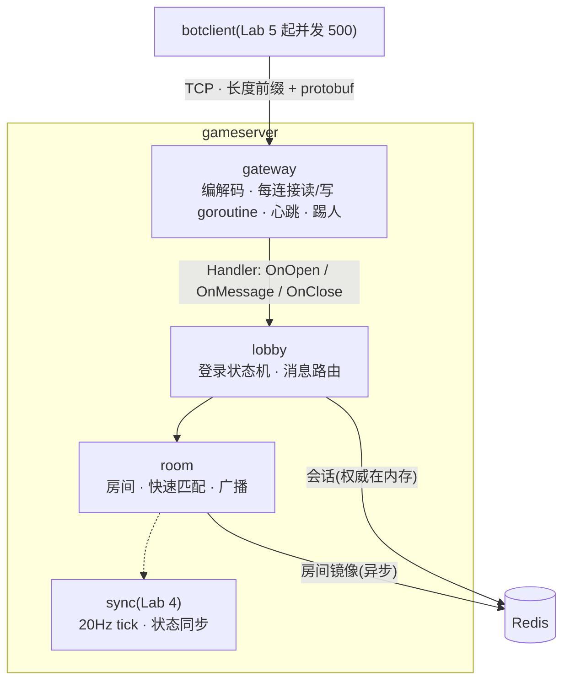
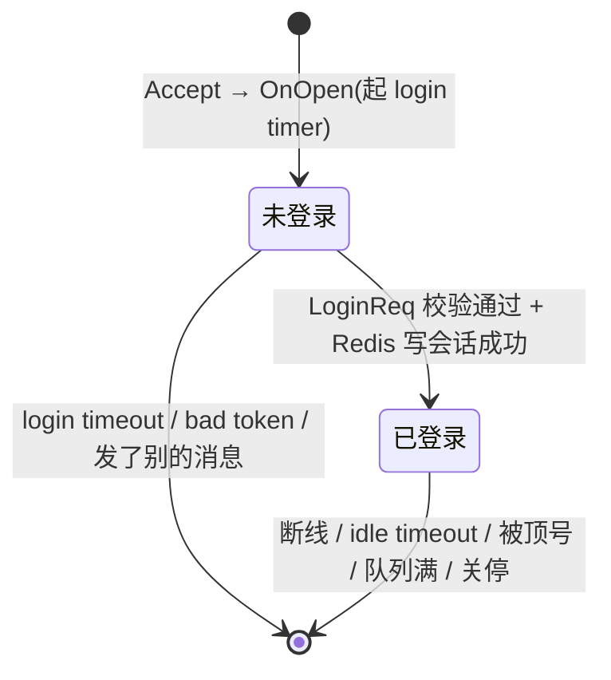

# ARCHITECTURE

## 分层



| 包 | 职责 | 依赖 |
|---|---|---|
| `internal/gateway` | TCP 连接、帧编解码、心跳应答、idle 踢人、发送队列 | `pb` |
| `internal/auth` | 签发 / 校验 HMAC token | 标准库 |
| `internal/lobby` | 登录状态机;登录后的消息分发给房间 | `gateway` `auth` `room` `storage` |
| `internal/room` | 房间成员关系、快速匹配、事件广播、镜像同步 | `gateway`(只用 `Marshal`)`pb` |
| `internal/storage` | Redis:会话、房间镜像 | `room`(只用 `Info`)、go-redis |
| `cmd/gameserver` | 读配置、组装、信号处理 | 以上全部 |
| `cmd/botclient` / `cmd/tokengen` | 测试工具 | `gateway` `auth` `pb` |

网关不认识业务:除了 Ping,所有消息都通过 `Handler` 交给大厅。

## 协议

```
+----------------------+-----------------------------------+
| length: uint32 大端  | body: Envelope 的 protobuf 编码    |
+----------------------+-----------------------------------+
```

- `length` 只计 body;body 为 0 字节或超过 64 KiB 都是协议错误,直接断开(D2)。
- body 永远是 `Envelope{seq, oneof payload}`(D1)。字段号按模块分段:10–19 网关,20–29 登录,30–39 房间,40–49 同步。
- `seq`:请求方自增,应答原样带回;服务端主动推送(广播、踢人)时 seq 为 0。

| 方向 | 消息 | 说明 |
|---|---|---|
| C → S | `Ping` | 心跳,网关直接回 `Pong`,登录前也能发 |
| S → C | `Kick` | 断开前的最后一帧,带原因 |
| C → S | `LoginReq{token}` | 连接上第一条业务消息 |
| S → C | `LoginResp{code, player_id}` | |
| C → S | `CreateRoomReq` / `JoinRoomReq{room_id}` / `QuickMatchReq` / `LeaveRoomReq` | 登录后才能发 |
| S → C | `RoomResp{code, room}` | 上面四种请求共用的应答 |
| S → C | `RoomEvent{kind, player_id, room}` | 推给房间里的其他人(不含触发者) |

结果码 `Code` 所有应答共用,0 是成功。完整定义见 `proto/game.proto`。

## 连接生命周期



关闭原因(日志里的 `reason`,也是 `OnClose` 收到的参数):

| 原因 | 谁触发 | 客户端会先收到 |
|---|---|---|
| `client closed` | 对端 EOF / RST | — |
| `idle timeout` | IdleTimeout 内没收到任何帧 | — |
| `protocol error` | 帧超限、截断、解码失败、没登录就发业务消息 | — |
| `send queue full` | 慢客户端,发送队列满 | — |
| `server shutdown` | 服务端关停 | — |
| `login timeout` | 连上之后 LoginTimeout 内没登录 | `Kick` |
| `bad token` | token 签名错 / 过期 / 格式错 | `LoginResp` 带错误码 |
| `replaced` | 同一账号在别的连接上登录 | `Kick` |

## 并发模型

- **每条连接两个 goroutine**:读 goroutine 解帧、分发,`Handler` 的三个回调都在它上面按顺序执行;写 goroutine 独占 `Write`,从有界队列取帧。任何 goroutine 调 `Send` 都只是投递,不阻塞,队列满就断开对方(D4)。
- **同一条连接的回调不并发**:连接可能被别的 goroutine 关掉(广播时发现队列满),但 `OnClose` 不在那个 goroutine 上跑,而是读 goroutine 被唤醒后再跑。所以大厅处理同一条连接的消息和断线时不用担心交错。
- **锁**:大厅一把、房间管理一把、网关的连接表一把。顺序固定为 大厅 → 房间 → 网关,没有反向调用,所以不会死锁。房间广播在房间锁里进行,前提是 `SendFrame` 不阻塞(D14)。
- **不在锁里做网络 I/O**:登录时先在锁外写 Redis,成功了再拿锁改内存;续期在锁里拍快照、锁外写;房间镜像同理(D7、D13)。

## 登录与会话

- token 是无状态的 HMAC 签名,校验不查存储(D6)。
- 「玩家 → 连接」的权威数据在大厅的内存表里;Redis 里的 `gs:session:{pid}` 是镜像,hash 存 `owner` 和 `login_at`,TTL 60 秒(D7、D9)。
- 续期:一个 goroutine 每 20 秒用一次 MULTI/EXEC 覆盖写全部在线玩家。覆盖写所以 Redis 重启后能补回来;写完再检查一遍,期间下线的玩家按 owner 删掉,防止续期把刚删的会话写回去。
- 删除会话用 Lua 脚本「owner 相同才删」,同一账号换了连接之后,旧连接断开删不掉新会话(D8)。

## 房间

- `room.Manager` 一把锁管全部房间(D12)。快速匹配进房间号最小的未满房间,没有就新建。
- 事件(JOINED / LEFT)编码一次,共享同一个 `[]byte`,在锁里发给除触发者以外的成员,保证顺序(D14)。
- Redis 镜像:`gs:rooms`(房间号 set)和 `gs:room:{id}`(成员 set)。变化记进 dirty 集合,镜像 goroutine 异步写;启动、每 30 秒、停止时各全量覆盖一次(D13)。

## 关停顺序

1. SIGINT / SIGTERM 取消 ctx。
2. 网关关 listener,关所有连接(原因 `server shutdown`)。
3. 每条连接的 `OnClose`:离开房间、删 Redis 会话。网关等这些全部跑完才返回(D5b)。
4. 后台 goroutine(续期、房间镜像)这时才停;房间镜像停之前最后全量同步一次,Redis 里不留房间。

## 下一步(Lab 4–6)

- **Lab 4 同步**:每个房间一个 20Hz tick。接入点:`room.Manager` 建房(`newRoomLocked`)和销毁房间(`Leave` 里删房间那一支)的地方,对应 tick 的启动和停止;`lobby.handlePlayerLocked` 是移动输入的分发入口。D12 的「什么时候会换」讨论了 tick 和全局锁的关系。
- **Lab 5 压测**:botclient 加并发;`gateway.Server.Count()` 和 `lobby.Lobby.Online()` 是在线人数指标的来源。
- **Lab 6 部署**:`deploy/docker-compose.yml` 目前只有 Redis。
